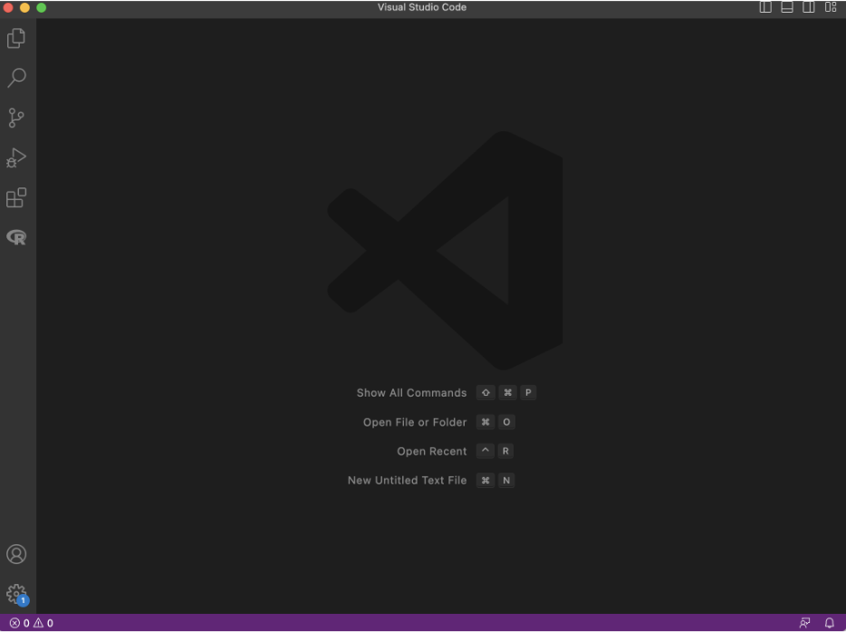
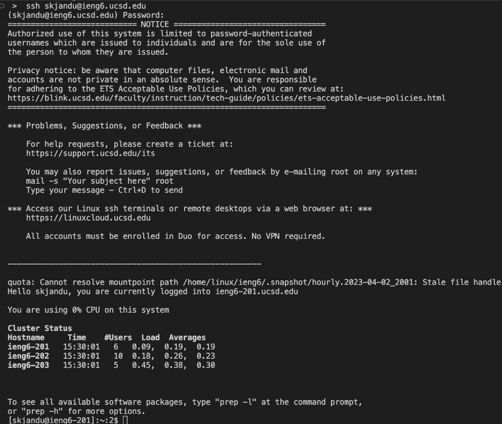
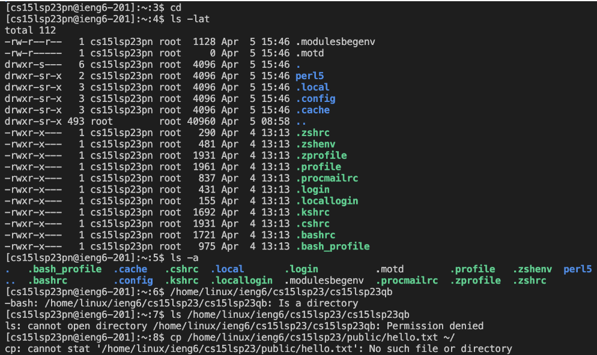

# Lab 1 - Remote Access and File System

## Step 1: Install VScode
The first step is to install VScode by going to the following [link](https://code.visualstudio.com/). Follow the instructions that are listed to download and install this tool on your computer. After VScode has been installed, open up a new window. It should look like this (note that I have chosen dark mode so this might vary based on your default settings): 

 

## Step 2: Remotely Connecting
Find your course-specific username at the following [link](https://sdacs.ucsd.edu/~icc/index.php). Use this [tutorial](https://drive.google.com/file/d/17IDZn8Qq7Q0RkYMxdiIR0o6HJ3B5YqSW/view?usp=share_link) to reset your password to the account. Every username has the same format: `cs15lsp23zz@ieng6.ucsd.edu`. The letters that replace 'zz' is unique to each person enrolled in the course, so make sure to remember those two letters. You will use this to log in to the remote server.

Open a terminal in VSCode. This can be done using Ctrl or Command + `, or selecting the Terminal → New Terminal option in the menu. You will be using the ssh command to gain remote access to a computer in the CSE basement. To log on to the server, you must verify your identity using your unique course specific account. Replace the 'zz' below with the letters in your username:

```
$ ssh cs15lsp23zz@ieng6.ucsd.edu
```

Because this is probably the first time you are logging into this server, your terminal will ask you "Are you sure if you want to continue connecting (yes/no/[fingerprint])?" Type "yes" and press enter to continue logging in. Then, it will prompt you to type in your password, which you just created when resetting your password. Although it will not look like anything is being typed on your terminal, the keys that you press are considered part of your password. 

Once you are logged in, it should display a message similar to the one shown in the image below: 



Congrats, you're in! 

## Step 3: Try Some Commands
In order to get familiar with commands, you can try them out on the remote computer that you are logged into. Try going into different directories using `cd` or list the files and folders in different directories using `ls`. Below are some of these commands (and more) tried out in the remote server along with their results: 



Here is a walkthrough explanation of each command that I ran along with its result:
1. When running `cd` in the home directory, it did not return or change anything because `cd` alone is meant to return you to your home directory, which is where I already was. 
2. When running `ls -lat` in the home directory, it returned a list of all files and folders in long format including hidden files and in
order starting from most recently modified. The `-l` option indicates long format, `-a` indicates hidden files, and `-t` indicates order by time.  Long format includes extra information about each file and folder, such as the permissions, number of links, owner name, group name, file size, and the name of the file/folder. The files that are normally hidden are written in green in the screenshot above. 
3. Running `ls -a` in the home directory returned just the names of the files/folders contained in the home directory, including the hidden ones. 
4. I forgot to include a command in this line and instead just entered the name of a folder with its full path. That is why nothing happened and the terminal just indicated that the path that I provided is a directory. 
5. When trying `ls /home/linux/ieng6/cs15lsp23/cs15lsp23qb` to access the list of files/folders of my group member's home directory, I was not able to access it because I was denied permission. These privacy of these files/folders are likely set up so that it can only be accessed by that person when they are logged in. 
6. When trying `cp /home/linux/ieng6/cs15lsp23/public/hello.txt ~/` to copy a file from another directory to my home directory, an error occurred because the file that I was trying to copy over does not actually exist. This was indicated by the statement returned by the terminal. 
