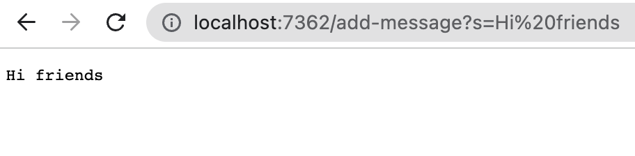
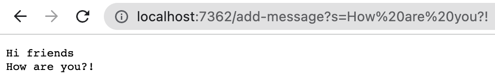

# Lab Report 2 – Servers and Bugs

## Part 1
My code for the StringServer web server is as follows:
```
package lab2;
import java.io.IOException;
import java.net.URI;

class Handler implements URLHandler {
    // The one bit of state on the server: a number that will be manipulated by
    // various requests.
    String message = "";

    public String handleRequest(URI url) {
        String[] parameters = url.getQuery().split("=");
        if (url.getPath().equals("/add-message") && parameters[0].equals("s")) {
            return message += (parameters[1] + "\n");
        } 
        else {
            return "404 Not Found!";
        }
    }
}

class StringServer {
    public static void main(String[] args) throws IOException {
        if(args.length == 0){
            System.out.println("Missing port number! Try any number between 1024 to 49151");
            return;
        }

        int port = Integer.parseInt(args[0]);

        Server.start(port, new Handler());
    }
}
```

For the first request, the method that I call is `start()`, which takes the port number as an integer argument `int port` and creates a new `Handler()` object `URLHandler handler`. In this case, we have `port = 7362`. This method is defined in the Server class, which was given to us during lab. The `Handler()` object calls the method `handleRequest()` which is defined in the code above. The `handleRequest()` method takes the url of the website as its parameter `URI url`. In this case, we have `url = localhost:7362/add-message?s=Hifriends`. In the `Handler` class above, we have the String variable `message` which holds the value of the text that will be displayed on the webpage. The value of the String variable `message` goes from an empty string to the value "Hi friends\n". Therefore, we have added the text "Hi friends" to the webpage:

 

For my second request, the server is already running so we do not need to call `start()` again. Because we didn't call the method, the value of `port` and `handler` stays the same. The method `handleRequest()` is called again and this time the value of its parameter is `url = localhost:7362/add-message?s=Howareyou?!`. This changed the value of the String variable `message` to "Hi friends/nHow are you?!" since it is concatenated to the previous text. Therefore, the webpage changes: 

 


## Part 2


