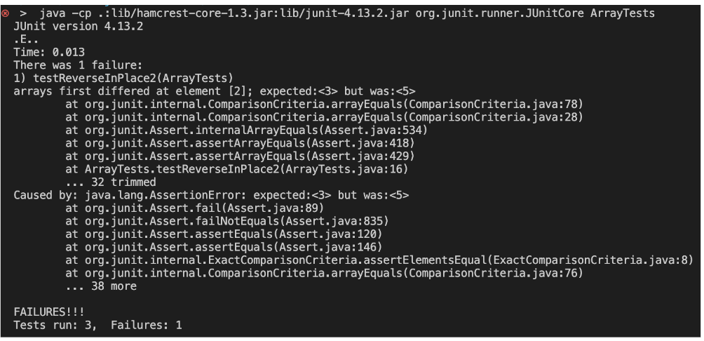
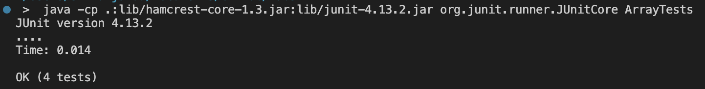

# Lab Report 2 – Servers and Bugs

## Part 1
My code for the StringServer web server is as follows:
```
package lab2;
import java.io.IOException;
import java.net.URI;

class Handler implements URLHandler {
    // The one bit of state on the server: a number that will be manipulated by
    // various requests.
    String message = "";

    public String handleRequest(URI url) {
        String[] parameters = url.getQuery().split("=");
        if (url.getPath().equals("/add-message") && parameters[0].equals("s")) {
            return message += (parameters[1] + "\n");
        } 
        else {
            return "404 Not Found!";
        }
    }
}

class StringServer {
    public static void main(String[] args) throws IOException {
        if(args.length == 0){
            System.out.println("Missing port number! Try any number between 1024 to 49151");
            return;
        }

        int port = Integer.parseInt(args[0]);

        Server.start(port, new Handler());
    }
}
```

For the first request, the method that I call is `start()`, which takes the port number as an integer argument `int port` and creates a new `Handler()` object `URLHandler handler`. In this case, we have `port = 7362`. This method is defined in the Server class, which was given to us during lab. The `Handler()` object calls the method `handleRequest()` which is defined in the code above. The `handleRequest()` method takes the url of the website as its parameter `URI url`. In this case, we have `url = localhost:7362/add-message?s=Hifriends`. In the `Handler` class above, we have the String variable `message` which holds the value of the text that will be displayed on the webpage. The value of the String variable `message` goes from an empty string to the value "Hi friends\n". Therefore, we have added the text "Hi friends" to the webpage:

 

For my second request, the server is already running so we do not need to call `start()` again. Because we didn't call the method, the value of `port` and `handler` stays the same. The method `handleRequest()` is called again and this time the value of its parameter is `url = localhost:7362/add-message?s=Howareyou?!`. This changed the value of the String variable `message` to "Hi friends\nHow are you?!\n" since it is concatenated to the previous text. Therefore, the webpage changes: 

 


## Part 2
The bug that I am choosing to analyze is in the `reverseInPlace()` method. One failure-inducing input is the list {3, 12, 5}, since I wanted to test a list that had more than one element. The input is shown below as a JUnit test:

```
@Test 
public void testReverseInPlace2() {
    int[] input1 = {3, 12, 5};
    ArrayExamples.reverseInPlace(input1);
    assertArrayEquals(new int[]{5, 12, 3}, input1);
}
```

An input that does not produce a failure is {3}, which is a list with a single element as shown below:

```
@Test 
public void testReverseInPlace1() {
    int[] input1 = { 3 };
    ArrayExamples.reverseInPlace(input1);
    assertArrayEquals(new int[]{ 3 }, input1);
}
```

The symptom of the failure-inducing input is shown below. The symptom is the incorrect value being at the last position of the array. The value was 5 rather than 3, which means the output list was {5, 12, 5}.

 

The symptom of the input that does not produce a failure is shown below. The tests pass successfully because it does not detect a failure.



The original code of the `reverseInPlace()` method is as follows:
```
// Changes the input array to be in reversed order
static void reverseInPlace(int[] arr) {
    for(int i = 0; i < arr.length; i += 1) {
      arr[i] = arr[arr.length - i - 1];
    }
}
```
The error in the code above is that out of the two elements being swapped, the first element takes the value of the second element. Then, when the second element is swapped with the first element, its value does not change, since we changed the value of the first element to equal the second element. This means we have lost the value of the first element and results in a duplication of the second element. We must solve this by storing the value of the first element in a temporary variable so that its value is not lost and can later be reassigned to the second element. We must also only traverse half of the array because if we traverse the entire array, then the values would be swapped twice and that would just return the array back to its original value. The code with the fixed bug is as follows:
```
// Changes the input array to be in reversed order
static void reverseInPlace(int[] arr) {
    for(int i = 0; i < (arr.length / 2); i += 1) {
          int temp = arr[i];
          arr[i] = arr[arr.length - i - 1];
          arr[arr.length - i - 1] = temp;
    }
} 
```

## Part 3
In week 2 lab, I learned how to create my own web server, which was really interesting. I learned how to write a program to change the display of the webpage based on the value of the url that I provide. There are various methods in Java that I was not familiar with before, like `getQuery()` and `getPath()` which makes it simple to extract different parts of the url. 
