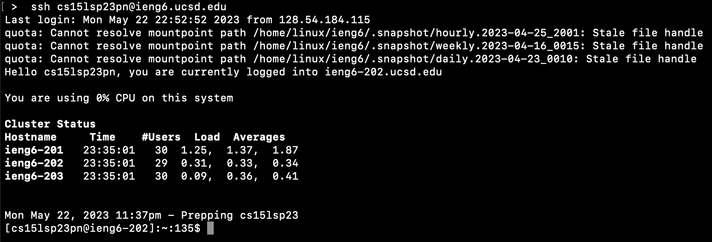

# Lab Report 4 - Doing it all from the Command Line

## Step 4: Log into ieng6



This command logged into the remote ieng6 server. No additional keys were used other than the command `ssh cs15lsp23pn@ieng6.ucsd.edu`. 

## Step 5: Clone your fork of the repository from your Github account 


This command cloned the lab 7 repository that I forked on Github. It used the `ssh` link rather than the `https` link to clone the repository. No additional keys were used other than the command `git clone git@github.com:ucsd-cse15l-s23/lab7.git`. 

## Step 6: Run the tests, demonstrating that they fail


Keys pressed: `cd l<tab> <enter>`. After cloning the repository, I needed to enter the `lab7` directory. I knew that it was the only directory that started with "l" so I used tab autocomplete to type out the rest of the name. 

Keys pressed: `ls` in order to see which files are in the `lab7` directory. 

Keys pressed: `bash t<tab> <enter>`. Next, I ran the junit tests by running the shell script `test.sh`. Again, I knew that it was the only file in the directory that started with "t" so I used tab autocomplete. 


## Step 7: Edit the code file to fix the failing test


Once vim mode was entered, the keys pressed were: `/change <enter> <j> <l> <l> <x> <i> <2> <esc> <:wq>` First, I searched for the word `change` since that is the comment that is located right above the line we want to change. Then, we navigate to character `1` located at the end of the word `index1` and delete that character by pressing `x`. Next, we enter insert mode by pressing `i` and type `2` in the place of `1`. Then, exit insert mode using the escape key. Finally, save and exit the file using `:wq`. 

## Step 8: Run the test, demonstrating that they now succeed 


I pressed the following keys: `<up> <up> <enter>` since the `bash test.sh` command was 2 up in the search history so I used the up arrow to access it. 

## Step 9: Commit and push the resulting change to Github account

```
$ git add ListExamples.java <enter>
$ git commit -m "fix typo in ListExamples.java" <enter>
$ git push _______
```
