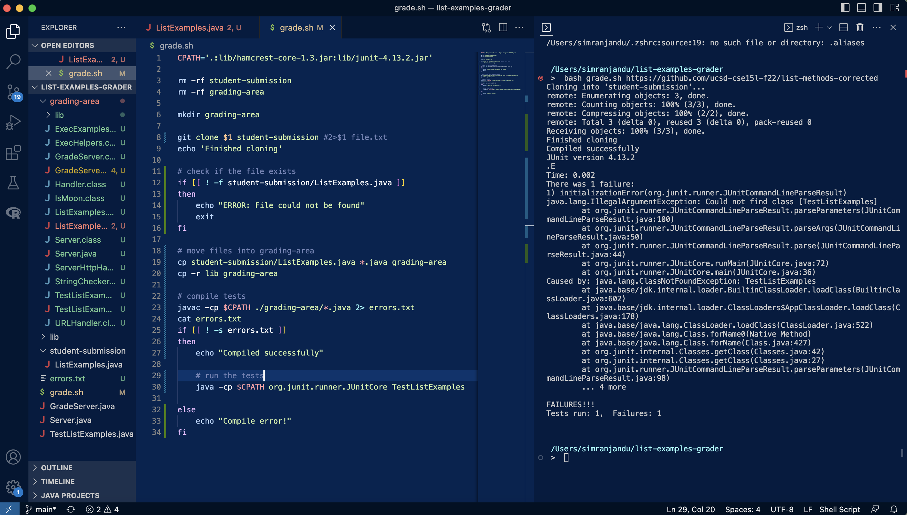
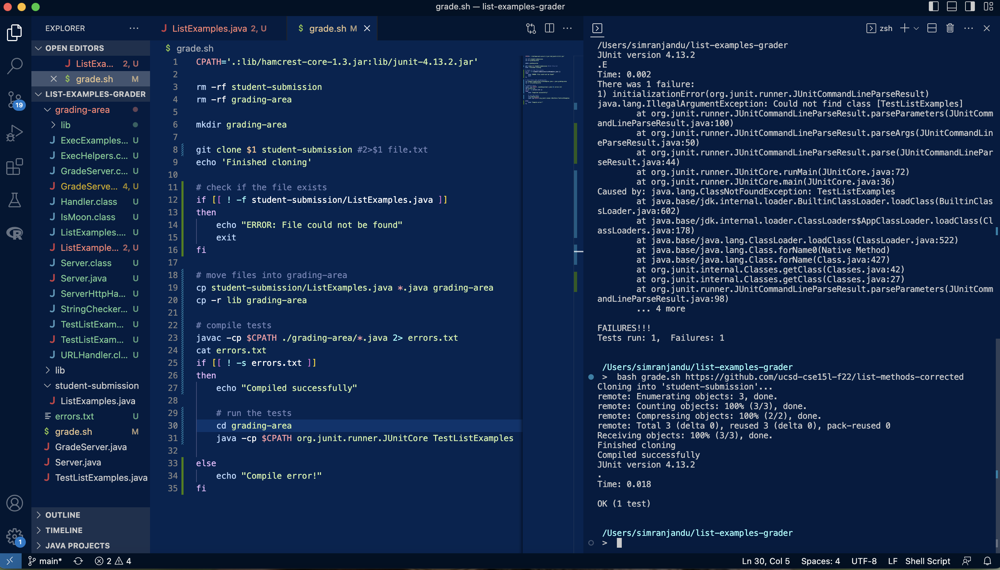

# Lab Report 5 - Debugging & Reflection

## Part 1: Debugging Scenario 

**Student post:** 

I am using a Macbook Pro with the MacOS operating system and VSCode as my programming editor. 

I am testing my `grade.sh` script with the mostly correct example student submission (given at the link <https://github.com/ucsd-cse15l-f22/list-methods-corrected>). The `GradeServer.java`, `Server.java`, and `TestListExamples.java` files along with the `lib` folder were obtained from the week 6 lab github repository [here](https://github.com/ucsd-cse15l-s23/list-examples-grader). I am using the following command in my VSCode terminal to run this test: 

```
$ bash grade.sh https://github.com/ucsd-cse15l-f22/list-methods-corrected
```

However, it is returning one failure, saying that it cannot find my `TestListExamples` class. I expected to have no failures with the junit tests passing with an "OK." Here is a screenshot of the error: 

In line 19 of my code shown in the screenshot, I copied all files ending in `.java` into the `grading-area` directory, which includes the `TestListExamples.java` file. Furthermore, I was able to compile the file, as indicated by the test message "Compiled successfully." Therefore, I am confused as to why the class file cannot be found, even though it was compiled and all the necessary files are in the `grading-area` directory. 

**TA response:**

Hi there! Since your error is saying that it cannot find the `TestListExamples` class, I suggest that you look at the organization of your directories and files. Try using the command `pwd` in your VSCode terminal to see the working directory that you are in. Find where the `TestListExamples` class file exists and make sure that you are in that directory. 

**Student follow-up response:**

Thank you for your help, I inserted the command `pwd` after line 29 in my code and discovered that I was in the directory `/Users/simranjandu/list-examples-grader`. This is not the correct directory since my `TestListExamples` class file is in the `grading-area` directory. Therefore, I replaced the `pwd` command after line 29 with the command `cd grading-area` so I could move into the correct directory. This fixed the error and my junit tests ran successfully. My file and directory structure did not need to be changed and is shown on the left-hand side of the screenshot. Here is what the correct output looks like: 


## Part 2: Reflection 

I learned how to use the `vim` test editor in my terminal, which makes it a lot easier to edit text files rather than opening up another application like VSCode. This expanded my knowledge about the capabilities of working with command-line. It was also helpful to practice using vim efficiently and save time by learning shortcuts. 